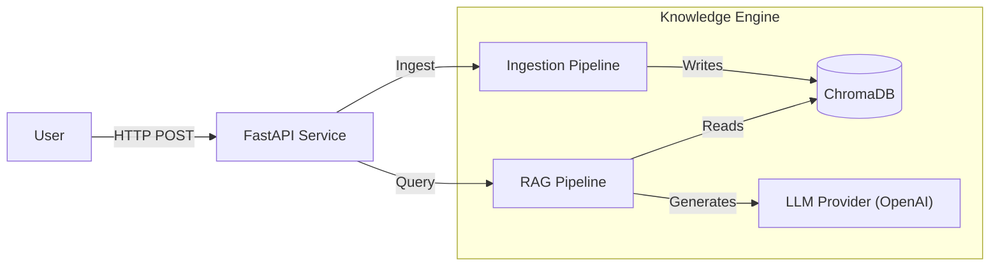
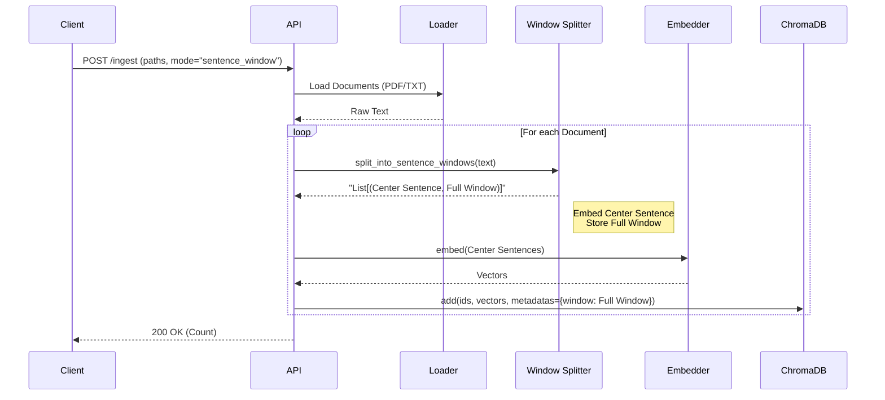

# Architecture Overview

This document provides visual diagrams of the **Advanced RAG Knowledge Engine** to help you understand how data flows through the system.

## 1. System Context
High-level view of how the User interacts with the API and the underlying RAG components.



## 2. Ingestion Pipeline (Offline)
How documents are processed, chunked, and indexed. Note the **Sentence Window** strategy.



## 3. Query Pipeline (Online)
The "Advanced RAG" flow featuring **HyDE** and **Cross-Encoder Reranking**.

```mermaid
flowchart TD
    Start([User Question]) --> HyDE{Use HyDE?}
    
    HyDE -- Yes --> GenHyDE[Generate Hypothetical Answer]
    GenHyDE --> Embed[Embed Text]
    HyDE -- No --> Embed
    
    Embed --> Retrieve[Vector Search (Top-K)]
    Retrieve --> Rerank{Use Reranker?}
    
    Rerank -- Yes --> CrossEncoder[Cross-Encoder Scoring]
    CrossEncoder --> Filter[Top-N Relevant]
    Rerank -- No --> Filter
    
    Filter --> Context[Construct Context Window]
    Context --> Prompt[Format Prompt]
    Prompt --> LLM[Generator LLM]
    LLM --> Answer([Final Answer])
```
